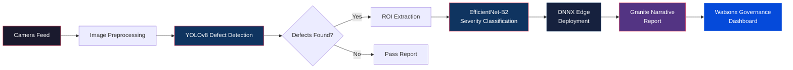
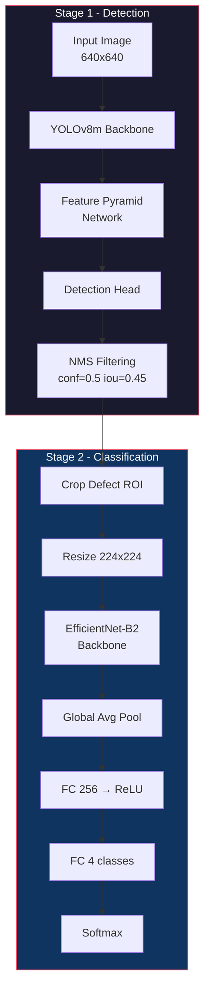
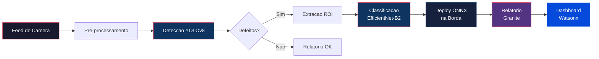

# Watsonx Industrial Quality Vision

[](https://www.python.org/)
[](https://www.ibm.com/watsonx)
[](https://pytorch.org/)
[](https://docs.ultralytics.com/)
[](https://onnxruntime.ai/)
[](LICENSE)
[]()

**[English](#english)** | **[Portugues](#portugues)**

---

<a name="english"></a>

## Overview

Industrial Quality Vision is a two-stage computer vision system for automated defect detection and severity classification on manufacturing production lines. The pipeline combines **YOLOv8** for real-time defect localization with **EfficientNet-B2** for fine-grained severity assessment, deployed at the edge via **ONNX Runtime** and governed through **IBM Watsonx**.

The system processes camera feeds from factory-floor inspection stations, identifies five defect categories across manufactured surfaces, classifies each defect into four severity levels, generates natural language inspection reports using IBM Granite, and tracks model performance through the Watsonx governance dashboard.

### Architecture



### Pipeline Detail



## Defect Classes

| Class | ID | Description | Typical Cause |
|-------|---:|-------------|---------------|
| `scratch` | 0 | Linear surface marks | Tool contact, handling |
| `dent` | 1 | Surface deformation | Impact, pressure |
| `crack` | 2 | Structural fracture lines | Stress, fatigue |
| `discoloration` | 3 | Color/surface anomalies | Heat, chemical exposure |
| `missing_part` | 4 | Absent component/feature | Assembly error |

## Severity Levels

| Level | ID | Action Required | SLA |
|-------|---:|-----------------|-----|
| `cosmetic` | 0 | Log only | 30 days |
| `minor` | 1 | Schedule repair | 7 days |
| `major` | 2 | Stop & rework | 24 hours |
| `critical` | 3 | Halt production line | Immediate |

## Tech Stack

| Layer | Technology |
|-------|-----------|
| Detection | YOLOv8m (Ultralytics) |
| Classification | EfficientNet-B2 (timm) |
| Deep Learning | PyTorch 2.1+ |
| Edge Deployment | ONNX Runtime |
| Data Augmentation | Albumentations |
| Image Processing | OpenCV |
| Narrative Reports | IBM Granite via Watsonx |
| Governance | IBM Watsonx AI Governance |
| API | FastAPI + Uvicorn |
| UI | Streamlit |
| Infrastructure | Docker, Docker Compose |

## Quick Start

### Prerequisites

- Python 3.10+
- CUDA-capable GPU (recommended)
- IBM Watsonx credentials (for governance features)

### Installation

```bash
# Clone repository
git clone https://github.com/galafis/watsonx-industrial-quality-vision.git
cd watsonx-industrial-quality-vision

# Create virtual environment
python -m venv .venv
source .venv/bin/activate  # Linux/Mac
# .venv\Scripts\activate   # Windows

# Install dependencies
pip install -r requirements.txt

# Install dev dependencies (for testing)
pip install -r requirements-dev.txt
```

### Environment Setup

```bash
cp .env.example .env
# Edit .env with your credentials:
# WATSONX_API_KEY=your_api_key
# WATSONX_PROJECT_ID=your_project_id
# WATSONX_URL=https://us-south.ml.cloud.ibm.com
```

### Running Tests

```bash
# Run all tests
make test

# Run with coverage
make test-cov
```

### Docker

```bash
# Build and start all services
docker-compose up -d

# API available at http://localhost:8080
# UI available at http://localhost:8501
```

## Project Structure

```
watsonx-industrial-quality-vision/
├── config/
│   └── settings.yaml              # Model and pipeline configuration
├── data/
│   ├── annotations/               # COCO-format annotation files
│   └── sample_images/             # Sample inspection images
├── docs/
│   └── architecture.md            # System architecture documentation
├── notebooks/
│   └── 01_quality_vision_demo.ipynb  # Interactive demo notebook
├── src/
│   ├── __init__.py
│   ├── config.py                  # Dataclass configurations
│   ├── api/                       # FastAPI REST endpoints
│   ├── data/
│   │   ├── __init__.py
│   │   ├── augmentation.py        # Albumentations pipelines
│   │   ├── dataset.py             # PyTorch Dataset (COCO format)
│   │   ├── preprocessing.py       # Normalization, ROI, color-space
│   │   └── synthetic_defects.py   # Cut-paste augmentation
│   ├── governance/                # Watsonx governance integration
│   ├── inference/                 # ONNX Runtime inference engine
│   ├── models/
│   │   ├── __init__.py
│   │   ├── classifier.py          # EfficientNet severity classifier
│   │   ├── detector.py            # YOLOv8 defect detector
│   │   ├── export_onnx.py         # ONNX export utilities
│   │   └── trainer.py             # Training pipeline
│   ├── narrative/                 # Granite report generation
│   └── ui/                        # Streamlit dashboard
├── tests/
│   ├── __init__.py
│   ├── test_augmentation.py
│   ├── test_classifier.py
│   ├── test_detector.py
│   ├── test_export_onnx.py
│   └── test_preprocessing.py
├── Dockerfile
├── Makefile
├── docker-compose.yml
├── pyproject.toml
├── requirements.txt
└── requirements-dev.txt
```

## Training Configuration

| Parameter | Value |
|-----------|-------|
| Detector architecture | YOLOv8m |
| Classifier architecture | EfficientNet-B2 |
| Detector input size | 640 x 640 |
| Classifier input size | 224 x 224 |
| Epochs | 100 |
| Batch size | 16 |
| Learning rate | 0.001 |
| Weight decay | 0.0005 |
| Early stopping patience | 15 epochs |
| LR scheduler | Cosine Annealing + Warmup |
| Warmup epochs | 5 |
| ONNX opset version | 17 |

## Author

**Gabriel Demetrios Lafis**

- GitHub: [@galafis](https://github.com/galafis)
- LinkedIn: [Gabriel Demetrios Lafis](https://linkedin.com/in/gabriel-demetrios-lafis)

## License

This project is licensed under the MIT License - see the [LICENSE](LICENSE) file for details.

---

<a name="portugues"></a>

## Visao Geral

Industrial Quality Vision e um sistema de visao computacional em dois estagios para deteccao automatizada de defeitos e classificacao de severidade em linhas de producao industriais. O pipeline combina **YOLOv8** para localizacao de defeitos em tempo real com **EfficientNet-B2** para avaliacao de severidade, implantado na borda via **ONNX Runtime** e governado pelo **IBM Watsonx**.

O sistema processa feeds de camera de estacoes de inspecao no chao de fabrica, identifica cinco categorias de defeitos em superficies manufaturadas, classifica cada defeito em quatro niveis de severidade, gera relatorios de inspecao em linguagem natural usando IBM Granite e monitora a performance do modelo atraves do dashboard de governanca Watsonx.

### Arquitetura



## Classes de Defeitos

| Classe | ID | Descricao | Causa Tipica |
|--------|---:|-----------|--------------|
| `scratch` | 0 | Marcas lineares na superficie | Contato com ferramentas |
| `dent` | 1 | Deformacao na superficie | Impacto, pressao |
| `crack` | 2 | Linhas de fratura estrutural | Estresse, fadiga |
| `discoloration` | 3 | Anomalias de cor/superficie | Calor, exposicao quimica |
| `missing_part` | 4 | Componente ausente | Erro de montagem |

## Niveis de Severidade

| Nivel | ID | Acao Requerida | SLA |
|-------|---:|----------------|-----|
| `cosmetic` | 0 | Apenas registrar | 30 dias |
| `minor` | 1 | Agendar reparo | 7 dias |
| `major` | 2 | Parar e retrabalhar | 24 horas |
| `critical` | 3 | Parar linha de producao | Imediato |

## Inicio Rapido

```bash
# Clonar repositorio
git clone https://github.com/galafis/watsonx-industrial-quality-vision.git
cd watsonx-industrial-quality-vision

# Criar ambiente virtual
python -m venv .venv
source .venv/bin/activate  # Linux/Mac

# Instalar dependencias
pip install -r requirements.txt

# Executar testes
make test

# Iniciar com Docker
docker-compose up -d
```

## Estrutura do Projeto

```
watsonx-industrial-quality-vision/
├── config/settings.yaml           # Configuracao de modelos e pipeline
├── data/                          # Dados de anotacoes e imagens
├── docs/architecture.md           # Documentacao de arquitetura
├── notebooks/                     # Notebooks de demonstracao
├── src/
│   ├── config.py                  # Configuracoes (dataclasses)
│   ├── data/                      # Dataset, augmentacao, pre-processamento
│   ├── models/                    # Detector YOLOv8, Classificador EfficientNet
│   ├── governance/                # Integracao Watsonx Governance
│   ├── inference/                 # Engine de inferencia ONNX
│   ├── narrative/                 # Geracao de relatorios Granite
│   └── ui/                        # Dashboard Streamlit
├── tests/                         # Testes unitarios
├── Dockerfile
├── docker-compose.yml
└── pyproject.toml
```

## Autor

**Gabriel Demetrios Lafis**

- GitHub: [@galafis](https://github.com/galafis)
- LinkedIn: [Gabriel Demetrios Lafis](https://linkedin.com/in/gabriel-demetrios-lafis)

## Licenca

Este projeto esta licenciado sob a Licenca MIT - veja o arquivo [LICENSE](LICENSE) para detalhes.
