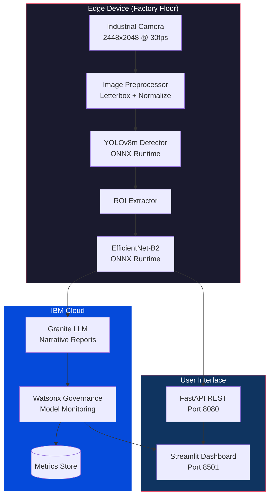
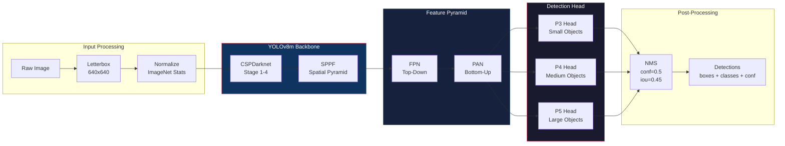
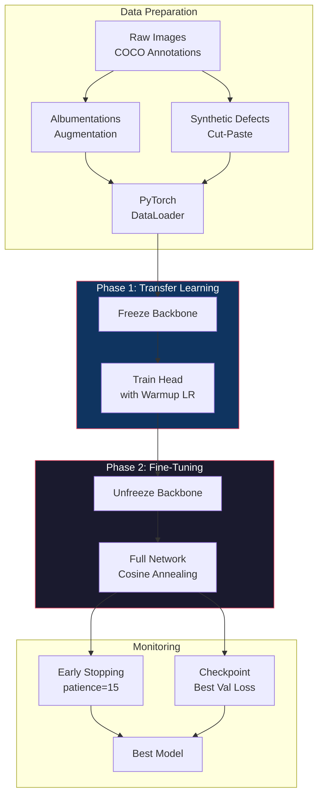
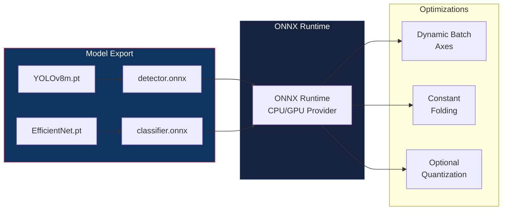
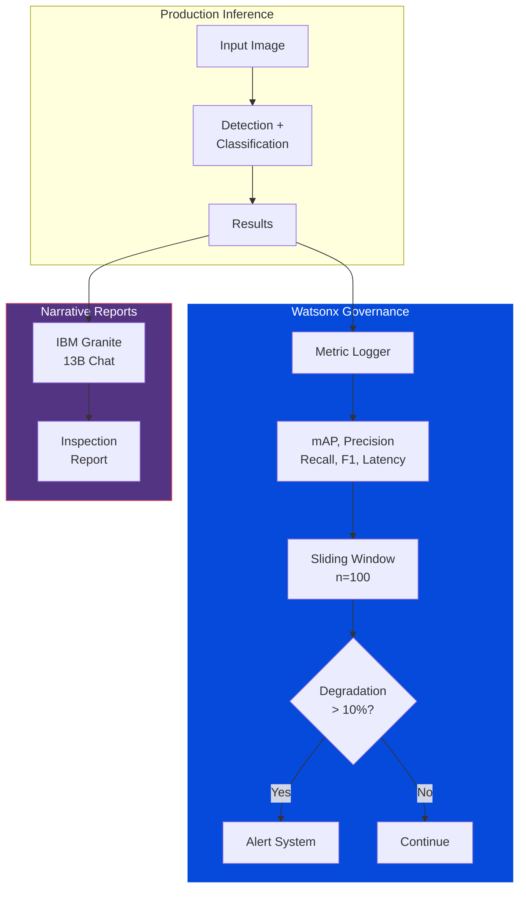
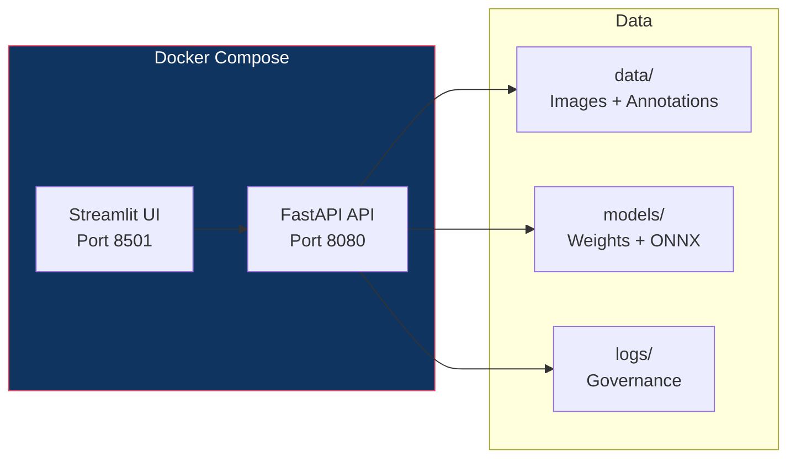

# Architecture - Industrial Quality Vision

## System Overview

Industrial Quality Vision implements a two-stage computer vision pipeline for automated defect detection and severity classification on manufacturing production lines. The system is designed for edge deployment with centralized governance through IBM Watsonx.

## High-Level Architecture



## Detection Pipeline

### Stage 1: YOLOv8 Defect Detection

The detection stage uses YOLOv8m (medium) for real-time defect localization across five categories.



**Defect Classes:**

| ID | Class | Description |
|---:|-------|-------------|
| 0 | scratch | Linear surface marks from tool contact |
| 1 | dent | Surface deformation from impact/pressure |
| 2 | crack | Structural fracture lines from stress |
| 3 | discoloration | Color anomalies from heat/chemical exposure |
| 4 | missing_part | Absent components from assembly error |

### Stage 2: EfficientNet-B2 Severity Classification

Each detected defect ROI is extracted, resized, and classified into severity levels.

```mermaid
flowchart LR
    subgraph Extract["ROI Extraction"]
        DET[Detection Box] --> CROP[Crop + Pad 10%]
        CROP --> RSZ[Resize\n224x224]
        RSZ --> NORM2[Normalize\nImageNet Stats]
    end

    subgraph Model["EfficientNet-B2"]
        NORM2 --> BB[Backbone\nMBConv Blocks]
        BB --> GAP[Global Avg\nPooling]
    end

    subgraph ClassHead["Classification Head"]
        GAP --> D1[Dropout 0.3]
        D1 --> FC1[FC 256]
        FC1 --> RELU[ReLU]
        RELU --> D2[Dropout 0.2]
        D2 --> FC2[FC 4]
        FC2 --> SM[Softmax]
    end

    subgraph Output["Output"]
        SM --> SEV[Severity Level\n+ Probability]
    end

    style Model fill:#0f3460,stroke:#e94560,color:#fff
    style ClassHead fill:#16213e,stroke:#0f3460,color:#fff
```



**Severity Levels:**

| ID | Level | Action | SLA |
|---:|-------|--------|-----|
| 0 | cosmetic | Log only | 30 days |
| 1 | minor | Schedule repair | 7 days |
| 2 | major | Stop and rework | 24 hours |
| 3 | critical | Halt production line | Immediate |

## Training Pipeline



### Training Configuration

| Parameter | Value |
|-----------|-------|
| Epochs | 100 |
| Batch size | 16 |
| Learning rate | 0.001 |
| Weight decay | 0.0005 |
| LR scheduler | Cosine Annealing |
| Warmup epochs | 5 |
| Early stopping | 15 epochs patience |
| Optimizer | AdamW |

### Data Augmentation Pipeline

The augmentation pipeline simulates real-world factory imaging conditions:

| Augmentation | Purpose | Probability |
|-------------|---------|------------|
| Horizontal Flip | Orientation invariance | 0.5 |
| Vertical Flip | Orientation invariance | 0.2 |
| Rotation (15 deg) | Camera angle variation | 0.5 |
| Perspective | Lens distortion | 0.3 |
| Brightness/Contrast | Lighting changes | 0.6 |
| CLAHE | Surface detail enhancement | 0.3 |
| Gaussian Noise | Sensor noise | 0.4 |
| Motion Blur | Camera vibration | 0.3 |
| Random Shadow | Shadow casting | 0.3 |

## Edge Deployment



### ONNX Export Settings

| Setting | Value |
|---------|-------|
| Opset version | 17 |
| Dynamic axes | Enabled (batch dimension) |
| Constant folding | Enabled |
| Input validation | Enabled |
| Output comparison | PyTorch vs ONNX tolerance 1e-4 |

## Governance Architecture



### Governance Thresholds

| Metric | Threshold |
|--------|-----------|
| mAP | >= 0.85 |
| Precision | >= 0.80 |
| Recall | >= 0.80 |
| Shift window | 100 samples |
| Degradation alert | > 10% drop |

## Technology Stack

| Component | Technology | Purpose |
|-----------|------------|---------|
| Detection | YOLOv8m (Ultralytics) | Real-time defect localization |
| Classification | EfficientNet-B2 (timm) | Severity assessment |
| Edge Runtime | ONNX Runtime | Low-latency inference |
| Augmentation | Albumentations | Training data augmentation |
| Training | PyTorch + AdamW | Model training pipeline |
| Reports | IBM Granite | Natural language inspection reports |
| Governance | IBM Watsonx | Model performance tracking |
| API | FastAPI + Uvicorn | REST endpoints |
| UI | Streamlit | Interactive dashboard |
| Infrastructure | Docker Compose | Service orchestration |

## Infrastructure



### Container Architecture

| Service | Port | Base Image | Purpose |
|---------|------|-----------|---------|
| api | 8080 | python:3.12-slim | REST API for inference |
| ui | 8501 | python:3.12-slim | Streamlit dashboard |

## Module Structure

```
src/
├── config.py              # Dataclass configurations
│   ├── DetectorConfig     # YOLOv8 parameters
│   ├── ClassifierConfig   # EfficientNet parameters
│   ├── TrainingConfig     # Hyperparameters
│   ├── AugmentationConfig # Pipeline settings
│   ├── InferenceConfig    # ONNX export settings
│   ├── GovernanceConfig   # Monitoring thresholds
│   └── WatsonxSettings    # IBM Cloud credentials
├── data/
│   ├── dataset.py         # DefectDataset (COCO format)
│   ├── augmentation.py    # Albumentations pipelines
│   ├── preprocessing.py   # Image normalization/ROI
│   └── synthetic_defects.py # Cut-paste augmentation
├── models/
│   ├── detector.py        # DefectDetector (YOLOv8)
│   ├── classifier.py      # SeverityClassifierNet
│   ├── trainer.py         # ClassifierTrainer
│   └── export_onnx.py     # ONNX export utilities
├── governance/            # Watsonx governance integration
├── inference/             # ONNX inference engine
├── narrative/             # Granite report generation
├── api/                   # FastAPI endpoints
└── ui/                    # Streamlit dashboard
```
